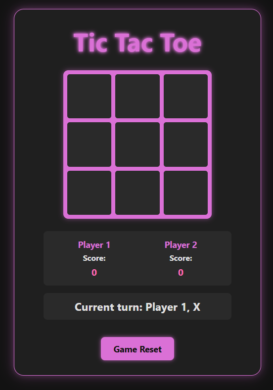

# TOP-TicTacToe
The Odin Project | Project: Tic Tac Toe

A classic Tic Tac Toe game built as part of The Odin Project's curriculum. This project focuses on implementing game logic, DOM manipulation, and user interface design using HTML, CSS, and JavaScript.

## Live Demo

[Link to live demo](https://reskyuu.github.io/TOP-TicTacToe/)

## Screenshot

 

## Features

*   Play against another player on the same computer.
*   Player name input and customization of 'X' or 'O' markers.
*   Score tracking for multiple rounds.
*   Clear visual indication of the current player's turn.
*   Winning line highlighting (optional, if implemented).
*   Responsive design for various screen sizes.
*   "New Game" / "Reset" functionality.
*   Stylish neon-themed interface.

## Technologies Used

*   HTML5
*   CSS3
    *   Flexbox
    *   Grid
    *   Custom Properties (Variables)
    *   Responsive Design (Media Queries)
*   JavaScript (ES6+)
    *   DOM Manipulation
    *   Event Handling
    *   Game Logic
    *   Factory Functions / Modules (if used)

## Project Goals (from The Odin Project)

*   Understanding of factory functions and the module pattern.
*   Practice DOM manipulation and event handling.
*   Implement game logic for a turn-based game.
*   Create an engaging user interface.

## How to Play

1.  Open the `index.html` file in your web browser or visit the live demo link.
2.  A dialog will appear to enter names for Player 1 and Player 2.
3.  Choose your markers (X or O).
4.  Click "Start Game".
5.  Players take turns clicking on an empty cell on the 3x3 grid.
6.  The first player to get three of their marks in a row (horizontally, vertically, or diagonally) wins the round.
7.  If all cells are filled and no player has won, the round is a draw.
8.  Scores are updated after each round.
9.  Click the "Reset Game" button to start a new game with the same players or to change player names/markers.

## Acknowledgements

*   [The Odin Project](https://www.theodinproject.com/) for the project idea and learning path.